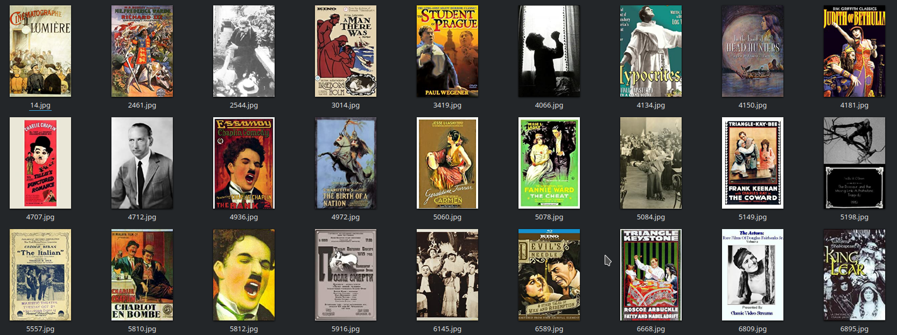

  

# Breast Cancer Images on Histopathology Slides

This dataset1 contains images of breast cancer on histopathology slides.

The data can be used to build and train an ML model that can detect breast cancer.

# Structure

This repo contains the following structure:

- **data/**: contains the CSV files and directory with images.
  - **test**: contains **benign** and **malignant** subdirectories of images for testing.
  - **train**: contains **benign** and **malignant** subdirectories of images for training.
- **dastaset.csv**: CSV file for use in loading the data in PerceptiLabs.

  

The following shows a partial example of the data stored in **dataset.csv* that is used to load the data into PerceptiLabs. The labels indicate the respective condition depicted in each image.

| **images** | **labels** |
|------------|--------------|
| data/train/benign/SOB_B_F-14-29960AB-400-015.png |	benign |
| data/train/benign/SOB_B_PT-14-21998AB-400-039.png |	benign |
| data/train/malignant/SOB_M_LC-14-13412-400-023.png |	malignant | 
| data/train/malignant/SOB_M_PC-14-15704-400-015.png |  malignant |

# Community

Got questions, feedback, or want to join a community of machine learning practitioners working with exciting tools and projects? Check out our [Community](https://forum.perceptilabs.com/)!

1 Dataset Credits: https://www.kaggle.com/forderation/breakhis-400x
